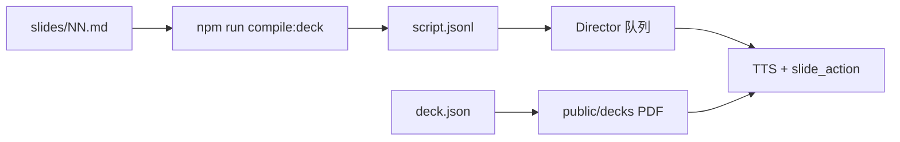

# content/decks 答辩内容包

Phase 1 Step 2：用 **Markdown 写讲稿**，编译为 `DirectorAction` 队列，驱动 Present 模式播放 + PDF 翻页。

## 工作流

1. 准备 PDF → `apps/presenter-onair/public/decks/<deckId>/slides.pdf`
2. 新建 `content/decks/<deckId>/deck.json`
3. 在 `slides/` 下按页写 `01.md`、`02.md` …
4. 运行 `npm run compile:deck`（或 `npm run compile:deck -w @ssreporter/director`）
5. `npm run dev` → 汇报模式 → 导演台 **播放本场讲稿**



## deck.json

```json
{
  "id": "demo",
  "title": "答辩示例",
  "slideSource": {
    "type": "pdf",
    "url": "/decks/demo/slides.pdf"
  },
  "scriptUrl": "/content/decks/demo/script.jsonl"
}
```

| 字段 | 说明 |
|------|------|
| `id` | 与目录名一致 |
| `title` | 汇报工具栏标题 |
| `slideSource.url` | 相对 `public/` 的 PDF 路径 |
| `scriptUrl` | 可选；默认 `/content/decks/<id>/script.jsonl` |

开发时 Vite 通过 `/content/…` 直接读取仓库内 `content/` 目录（见 `vite-content-plugin.ts`）。

## slides/NN.md 格式（主格式）

文件名 = 页码（`01.md` → 第 1 页）。

```markdown
---
emotion: friendly
gesture: bow
action_id: present-01
slide_action: {"goto": 1}
---

各位老师好，我是答辩助手。接下来由我介绍项目背景与目标。
```

| frontmatter | 必填 | 默认 | 说明 |
|-------------|------|------|------|
| （正文） | 是 | — | TTS 朗读全文 |
| `emotion` | 否 | `neutral` | schema 枚举 |
| `gesture` | 否 | 第 1 页 `bow`，其余 `explain` | schema 枚举 |
| `camera` | 否 | `bust` | |
| `action_id` | 否 | `p{NN}` | |
| `slide_action` | 否 | `{"goto": 页码}` | JSON 字符串；跨页用 `{"next":true}` 等 |

`slide_action` 须写在一行 JSON，例如：

- `slide_action: {"goto": 3}`
- `slide_action: {"next": true}`

## 编译

```bash
npm run compile:deck
# 指定场次（可选）
cd packages/director && DECK_ID=my-deck npm run compile:deck
```

输出：`content/decks/<deckId>/script.jsonl`（每行一条 `DirectorAction`）。

编译器：[`packages/director/src/compile-deck-script.ts`](../packages/director/src/compile-deck-script.ts)

## 播放

- 应用读取 `deck.json`（优先 `/content/decks/<id>/`）
- 讲稿读取 `scriptUrl` 指向的 `script.jsonl`
- Director 面板 **播放本场讲稿** → `validateDirectorAction` → 入队 → 顺序播放

`activeDeckId` 来自设置 `present.activeDeckId`（默认 `demo`）。

## 新建一场答辩

```bash
mkdir -p content/decks/my-defense/slides
# 编写 deck.json、slides/01.md …
# 复制 PDF 到 public/decks/my-defense/slides.pdf
npm run compile:deck
# 在应用中把 activeDeckId 设为 my-defense（后续可在 UI 选择）
```

## 相关文件

| 用途 | 路径 |
|------|------|
| 编译器 | `packages/director/src/compile-deck-script.ts` |
| 编译 CLI | `packages/director/src/compile-deck-cli.test.ts` |
| 运行时加载讲稿 | `apps/presenter-onair/src/lib/content/loadDeckScript.ts` |
| deck 加载 | `apps/presenter-onair/src/lib/present/loadDeck.ts` |
| Director 面板 | `apps/presenter-onair/src/components/DirectorPanel.tsx` |
| demo 样例 | `content/decks/demo/` |

## 备选格式（后续）

单文件 `script.md` 用 `## 第 N 页` 分段——尚未实现，需要时可加解析器。
